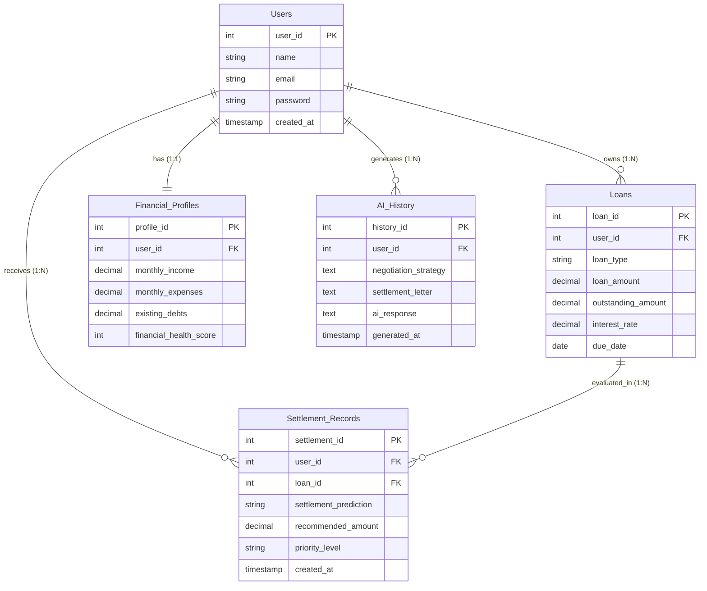

# ER Diagram Design and Analysis for FinRelief AI

FinRelief AI is an AI-powered debt relief and financial recovery platform. This document presents the revised database schema design, entity relationship (ER) diagram, comprehensive data dictionary, normalization verification, use cases, and cloud-scale analysis based on the specific system specifications.

---

## 1. System Architecture & Domain Model

The database represents a highly focused domain structure containing five primary entities:
1. **Users**: Houses core identity, credentials, and authentication metadata for borrowers.
2. **Loans**: Records individual loan instruments, current outstanding balances, interest rates, and maturities.
3. **Financial_Profiles**: Maintains snapshots of the borrower's disposable monthly income, expenses, structural debts, and overall calculated financial health metrics.
4. **Settlement_Records**: Keeps track of AI-generated settlement evaluations, priority levels, predicted outcomes, and recommended negotiation targets.
5. **AI_History**: Contains the audit log of all AI negotiation strategies, interaction timelines, and dynamic settlement letters produced.

---

## 2. Entity-Relationship Diagram (ERD)

The following Mermaid diagram maps out the relationships, key fields, and cardinalities:



---

## 3. Data Dictionary

### 3.1 `Users` Table
Holds the client profiles for registered borrowers.

| Column Name | Data Type | Nullability | Constraints | Description |
| :--- | :--- | :--- | :--- | :--- |
| `user_id` | `INT` | NOT NULL | PRIMARY KEY | Unique identifier for each borrower. |
| `name` | `VARCHAR(150)` | NOT NULL | | Full name of the borrower. |
| `email` | `VARCHAR(255)` | NOT NULL | UNIQUE | Unique login and contact email. |
| `password` | `VARCHAR(255)` | NOT NULL | | Encrypted/hashed password for secure authentication. |
| `created_at` | `TIMESTAMP` | NOT NULL | DEFAULT NOW() | Account registration timestamp. |

---

### 3.2 `Loans` Table
Stores individual borrowing instruments and outstanding liabilities linked to users.

| Column Name | Data Type | Nullability | Constraints | Description |
| :--- | :--- | :--- | :--- | :--- |
| `loan_id` | `INT` | NOT NULL | PRIMARY KEY | Unique identifier for the loan record. |
| `user_id` | `INT` | NOT NULL | FOREIGN KEY | References `Users.user_id`. |
| `loan_type` | `VARCHAR(50)` | NOT NULL | | E.g., `student_loan`, `credit_card`, `mortgage`, `personal`. |
| `loan_amount` | `DECIMAL(15,2)`| NOT NULL | CHECK (>= 0) | Initial principal amount borrowed. |
| `outstanding_amount`| `DECIMAL(15,2)`| NOT NULL | CHECK (>= 0) | Remaining unpaid debt balance. |
| `interest_rate` | `DECIMAL(5,2)` | NOT NULL | CHECK (0 to 100) | Annual Percentage Rate (APR). |
| `due_date` | `DATE` | NOT NULL | | Repayment/maturity deadline. |

---

### 3.3 `Financial_Profiles` Table
Maintains detailed snapshots of a borrower's overall financial parameters.

| Column Name | Data Type | Nullability | Constraints | Description |
| :--- | :--- | :--- | :--- | :--- |
| `profile_id` | `INT` | NOT NULL | PRIMARY KEY | Unique profile record identifier. |
| `user_id` | `INT` | NOT NULL | FOREIGN KEY, UNIQUE | References `Users.user_id` (enforces 1:1 relationship). |
| `monthly_income` | `DECIMAL(15,2)`| NOT NULL | CHECK (>= 0) | Self-reported monthly disposable income. |
| `monthly_expenses`| `DECIMAL(15,2)`| NOT NULL | CHECK (>= 0) | Summarized monthly living expenses. |
| `existing_debts` | `DECIMAL(15,2)`| NOT NULL | CHECK (>= 0) | Additional outside liabilities. |
| `financial_health_score`| `INT` | NULL | CHECK (0 to 100) | Algorithmic creditworthiness or capacity score. |

---

### 3.4 `Settlement_Records` Table
Logs AI and manual evaluations regarding settlement margins and priorities.

| Column Name | Data Type | Nullability | Constraints | Description |
| :--- | :--- | :--- | :--- | :--- |
| `settlement_id` | `INT` | NOT NULL | PRIMARY KEY | Unique prediction identifier. |
| `user_id` | `INT` | NOT NULL | FOREIGN KEY | References `Users.user_id`. |
| `loan_id` | `INT` | NOT NULL | FOREIGN KEY | References `Loans.loan_id`. |
| `settlement_prediction`| `VARCHAR(255)`| NOT NULL | | AI classification of probability (e.g., `high`, `medium`, `low`). |
| `recommended_amount`| `DECIMAL(15,2)`| NOT NULL | CHECK (>= 0) | Recommended target settlement payoff amount. |
| `priority_level` | `VARCHAR(30)` | NOT NULL | | Urgency tag (e.g., `critical`, `high`, `normal`). |
| `created_at` | `TIMESTAMP` | NOT NULL | DEFAULT NOW() | Timestamp when evaluation was generated. |

---

### 3.5 `AI_History` Table
Captures negotiation sessions, generated legal documents, and responses.

| Column Name | Data Type | Nullability | Constraints | Description |
| :--- | :--- | :--- | :--- | :--- |
| `history_id` | `INT` | NOT NULL | PRIMARY KEY | Unique AI interaction identifier. |
| `user_id` | `INT` | NOT NULL | FOREIGN KEY | References `Users.user_id`. |
| `negotiation_strategy`| `TEXT` | NOT NULL | | Summary of strategy (e.g., Avalanche negotiation). |
| `settlement_letter` | `TEXT` | NOT NULL | | HTML/Markdown representation of generated settlement proposal letter. |
| `ai_response` | `TEXT` | NOT NULL | | Raw system logs or feedback from the AI core. |
| `generated_at` | `TIMESTAMP` | NOT NULL | DEFAULT NOW() | Action timestamp. |

---

## 4. Normalization and Structural Analysis

### 4.1 First Normal Form (1NF)
* **Requirement**: All attributes must be atomic, rows must be uniquely identifiable via a Primary Key, and there must be no repeating groups.
* **Analysis**: Each table defines a single primary key (e.g. `user_id`, `loan_id`). Attributes like `negotiation_strategy` and `settlement_letter` store discrete, individual documents or strings. There are no composite collections or nested array structures stored directly within columns. 
* **Conclusion**: Meets **1NF**.

### 4.2 Second Normal Form (2NF)
* **Requirement**: Meet 1NF, and all non-key attributes must be fully functionally dependent on the entire Primary Key.
* **Analysis**: Since all tables employ a single-attribute surrogate integer primary key rather than a composite key, there are no partial dependencies possible. Every attribute in `Loans`, for example, is fully dependent on `loan_id`.
* **Conclusion**: Meets **2NF**.

### 4.3 Third Normal Form (3NF)
* **Requirement**: Meet 2NF, and no non-key attribute can be transitively dependent on the primary key (i.e. no non-key column determines another non-key column).
* **Analysis**: 
  - In `Users`, name and email depend solely on `user_id`.
  - In `Loans`, terms like type, amount, interest rate, and due date depend on the specific loan. The user reference (`user_id`) is a direct foreign key.
  - In `Financial_Profiles`, financial parameters depend directly on the profile entity. Even though `existing_debts` and `monthly_income` might be used to calculate `financial_health_score`, the score is calculated via external application-layer models and stored as an static value representing a snapshot at the time of calculation, which avoids transitive dependency violations.
  - In `Settlement_Records`, `recommended_amount` and `settlement_prediction` are generated properties depending on the specific evaluation iteration (`settlement_id`).
* **Conclusion**: Meets **3NF**.

---

## 5. Security & Privacy Considerations

Because this database contains personally identifiable information (PII) and debt data, security is paramount:
1. **Password Hashing**: The `Users.password` field must store hashes using modern key-derivation algorithms (such as bcrypt, scrypt, or Argon2id) rather than raw text.
2. **Column Encryption**: For cloud deployments, encrypt fields like `Users.email` and `Users.name` using AES-256 at the application layer to defend against database dump leaks.
3. **Data Loss Prevention**: Implement Row-Level Security (RLS) in databases like PostgreSQL so that users can query only their own records unless authorized as administrators.

---

## 6. Query Optimization & Index Mappings

To ensure rapid response times, key database indexes should be established:
* **Foreign Keys B-Tree Indexing**: Explicitly create indexes on all foreign key constraints since databases do not construct these by default:
  ```sql
  CREATE INDEX idx_loans_user ON Loans(user_id);
  CREATE INDEX idx_financial_profiles_user ON Financial_Profiles(user_id);
  CREATE INDEX idx_settlements_user ON Settlement_Records(user_id);
  CREATE INDEX idx_settlements_loan ON Settlement_Records(loan_id);
  CREATE INDEX idx_ai_history_user ON AI_History(user_id);
  ```
* **Performance Indexing for Searches**: Add a unique index on the email column for fast authentication lookups:
  ```sql
  CREATE UNIQUE INDEX idx_users_email ON Users(email);
  ```
